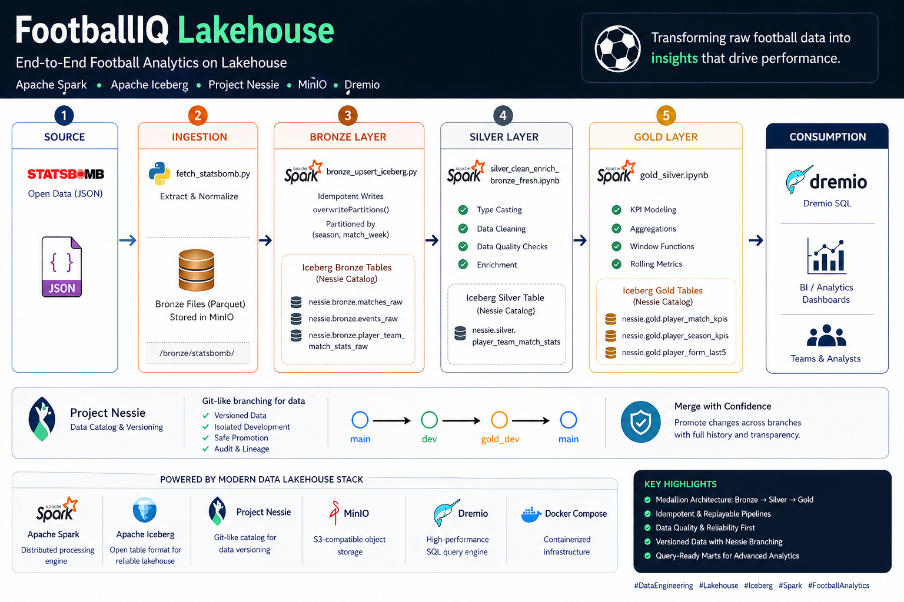

# FootballIQ Lakehouse

End-to-end football analytics lakehouse using Apache Spark, Apache Iceberg, Project Nessie, MinIO, and Dremio.



## What This Project Delivers

- A medallion pipeline (`bronze` -> `silver` -> `gold`) for player performance analytics.
- Idempotent batch processing with partition overwrite on Iceberg tables.
- Catalog-level governance and promotion with Nessie branching (`main`, `dev`, `gold_dev`).
- Query-ready marts for match KPIs, season KPIs, and rolling form KPIs.

## Architecture

```text
StatsBomb Open Data (JSON)
        |
        v
ingestion/fetch_statsbomb.py
        |
        v
Bronze files (local parquet) -> jobs/bronze_upsert_iceberg.py -> nessie.bronze.*
                                                        |
                                                        v
jobs/silver_clean_enrich_bronze_fresh.ipynb -> nessie.silver.player_team_match_stats
                                                        |
                                                        v
jobs/gold_silver.ipynb -> nessie.gold.player_match_kpis
                          nessie.gold.player_season_kpis
                          nessie.gold.player_form_last5
                                                        |
                                                        v
Dremio SQL analytics
```

## Project Hierarchy

```text
footballiq/
├── data/                              
├── docs/
│   ├── BRONZE_LAYER.md
│   ├── SILVER_LAYER_README.md
│   ├── GOLD_LAYER_README.md
│   └── INFRA_README.md
├── ingestion/
│   └── fetch_statsbomb.py             # Pulls and normalizes source JSON
├── jobs/
│   ├── bronze_upsert_iceberg.py       # Bronze -> Iceberg (idempotent overwrite)
│   ├── silver_clean_enrich_bronze_fresh.ipynb
│   ├── gold_silver.ipynb
│   └── merge_gold_dev_main.py         # Nessie merge automation
├── scripts/
│   ├── setup_spark_jars.sh
│   └── smoke-test.sh
├── spark/conf/spark-defaults.conf
├── docker-compose.yaml
└── README.md
```

## Infra and Runtime

- Stack is containerized with `docker-compose.yaml`.
- Spark is configured with Iceberg + Nessie extensions via `spark/conf/spark-defaults.conf`.
- MinIO bucket is `football-lake` with `bronze/`, `silver/`, `gold/` prefixes.
- A smoke test (`scripts/smoke-test.sh`) verifies Nessie, MinIO, Spark Iceberg writes, and Dremio reachability.

## End-to-End Data Flow (Real Run Sample)

Run context used in this repo:

- `competition_id=9`
- `season_id=281`
- `max_matches=10`

### 1) Source and Bronze extraction

Raw matches sample (`data/bronze/statsbomb/matches.parquet`):

| match_id | match_date | home_team | away_team | competition_id_input | season_id_input |
|---|---|---|---|---:|---:|
| 3895302 | 2024-04-14 | Bayer Leverkusen | Werder Bremen | 9 | 281 |
| 3895292 | 2024-04-06 | Union Berlin | Bayer Leverkusen | 9 | 281 |

Raw events sample (`data/bronze/statsbomb/events.parquet`):

| minute | match_id | type__name | team__name | player__name |
|---:|---:|---|---|---|
| 0 | 3895302 | Starting XI | Bayer Leverkusen | null |
| 0 | 3895302 | Starting XI | Werder Bremen | null |

Raw player-match sample (`data/bronze/statsbomb/player_team_match_stats.parquet`):

| match_id | player__name | team__name | pass_count | shot_count | goal_count | xg | match_week | season |
|---:|---|---|---:|---:|---:|---:|---:|---:|
| 3895220 | Granit Xhaka | Bayer Leverkusen | 137 | 0 | 0 | 0.000000 | 5 | 281 |
| 3895220 | Jonathan Tah | Bayer Leverkusen | 111 | 1 | 0 | 0.085958 | 5 | 281 |

### 2) Bronze Iceberg load

- `jobs/bronze_upsert_iceberg.py` loads bronze files into:
  - `nessie.bronze.matches_raw`
  - `nessie.bronze.events_raw`
  - `nessie.bronze.player_team_match_stats_raw`
- All bronze fields are stored as `STRING` (schema-on-read).
- Writes are idempotent via `overwritePartitions()` on `(season, match_week)`.

### 3) Silver transformation

- `jobs/silver_clean_enrich_bronze_fresh.ipynb` canonicalizes columns, enforces typed schema, and applies quality checks.
- Quality output in current run:
  - `xg_mean=0.10562219986764704`
  - `duplicate_keys=0`

### 4) Gold marts

`jobs/gold_silver.ipynb` publishes:

- `nessie.gold.player_match_kpis` (player-match KPIs)
- `nessie.gold.player_season_kpis` (player-season KPIs + ranks)
- `nessie.gold.player_form_last5` (rolling 5-match trend)

Real gold sample row (`nessie.gold.player_match_kpis` output):

| season_id | match_week | match_id | player_name | team_name | shot_count | goal_count | xg | xg_per_shot | shot_conversion |
|---:|---:|---:|---|---|---:|---:|---:|---:|---:|
| 281 | 20 | 3895348 | Ermedin Demirovic | Augsburg | 4 | 0 | 0.226136871 | 0.05653421775 | 0.0 |

## Topics Covered

- Iceberg table design and partition strategy for replayable weekly batches.
- Idempotent ingestion and transformation patterns with `overwritePartitions()`.
- Data quality contract design (hard checks + soft observability checks).
- Nessie branch lifecycle for isolated writes and controlled promotion.
- Gold semantic mart modeling for player analytics (volume, efficiency, contribution, form).
- Operational validation using snapshot/file metadata and smoke tests.

## Deep Concepts Learned

- How to use catalog branching as a governance layer, not only as a convenience feature.
- How schema-on-read bronze and typed silver reduce ingestion fragility while preserving lineage.
- How to design KPI marts with explicit metric taxonomy and consistent grain boundaries.
- How to reason about Iceberg snapshots, partitions, and file-level maintenance for reliability.
- How to structure deterministic reruns in batch pipelines without duplicate accumulation.

## Quick Start

```bash
./scripts/setup_spark_jars.sh
docker compose up -d
./scripts/smoke-test.sh
```

Then run ingestion and bronze load:

```bash
.venv/bin/python ingestion/fetch_statsbomb.py \
  --competition-id 9 \
  --season-id 281 \
  --max-matches 10 \
  --output-dir data/bronze/statsbomb

docker exec spark /opt/spark/bin/spark-submit \
  --master local[*] \
  /opt/spark/work-dir/jobs/bronze_upsert_iceberg.py \
  --input-dir /opt/spark/work-dir/data/bronze/statsbomb \
  --competition-id 9 \
  --season-id 281
```

Notebook stages:

- Silver: `jobs/silver_clean_enrich_bronze_fresh.ipynb`
- Gold: `jobs/gold_silver.ipynb`

## Supporting Docs

- `docs/INFRA_README.md`
- `docs/BRONZE_LAYER.md`
- `docs/SILVER_LAYER_README.md`
- `docs/GOLD_LAYER_README.md`
